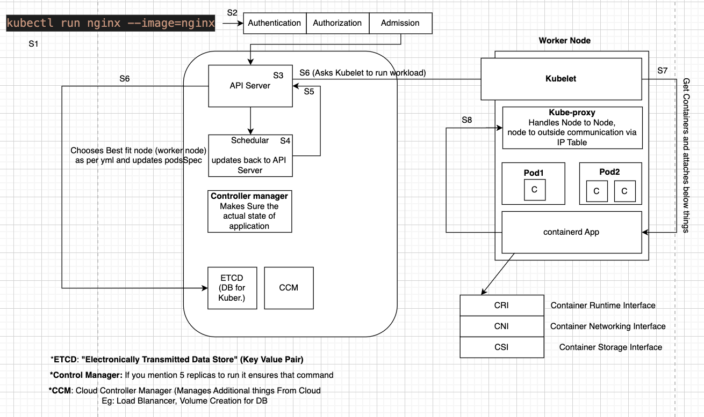

## whats inside pods
- ```kubectl run nginx --image=nginx```
- how kubectl talks with Kube clusters: using ```cat ~/.kube/config``` this file ```kubeconfig file```
- Check the flow here


## Contains of kubeconfig file
```
ninja@Sohams-MacBook-Air projects % kubectl config view
apiVersion: v1
clusters:           #This section defines the different Kubernetes clusters you can connect to
- cluster:
    certificate-authority-data: DATA+OMITTED
    server: https://127.0.0.1:6443
  name: docker-desktop
contexts:           # is a combination of a cluster, a user, and a namespace
- context:
    cluster: docker-desktop
    user: docker-desktop
  name: docker-desktop
current-context: docker-desktop
kind: Config
preferences: {}
users:             # authentication details for connecting to the Kubernetes clusters
- name: docker-desktop
  user:
    client-certificate-data: DATA+OMITTED
    client-key-data: DATA+OMITTED
```
    - A context specifies the default settings to use when interacting with the Kubernetes cluster.

## How Kubernetes finds kubeconfig file
- Check if exported on OS shell level
  ```export KUBECONFIG=path_to_YOUR_CONFIG_FILE```
- As a flag
  ```kubectl get nodes --kubeconfig ~/.kube/config```
- If not then default location: ~/.kube/config

## Merging multiple KubeConfig files
 - export KUBECONFIG=/path/to/first/config:/path/to/second/config:/path/to/third/config

## GVK & GVR
- GVK = Group Version Kind [Pods: Group is core; apiVersion: v1, kind: Pod]
```
ninja@Sohams-MacBook-Air ~ % kubectl run nginx --image=nginx --dry-run=client -o json
{
    "kind": "Pod",
    "apiVersion": "v1",
    "metadata": {
        "name": "nginx",
        "creationTimestamp": null,
        "labels": {
            "run": "nginx"
        }
    },
    "spec": {
        "containers": [
            {
                "name": "nginx",
                "image": "nginx",
                "resources": {}
            }
        ],
        "restartPolicy": "Always",
        "dnsPolicy": "ClusterFirst"
    },
    "status": {}
}
```
- GVR = Group Version Resource [kind: Deployment, apiVersion: apps/v1]
```
ninja@Sohams-MacBook-Air ~ % kubectl create deployment nginx --image=nginx --dry-run=client -o json              
{
    "kind": "Deployment",
    "apiVersion": "apps/v1",
    "metadata": {
        "name": "nginx",
        "creationTimestamp": null,
        "labels": {
            "app": "nginx"
        }
    },
    "spec": {
        "replicas": 1,
        "selector": {
            "matchLabels": {
                "app": "nginx"
            }
        },
        "template": {
            "metadata": {
                "creationTimestamp": null,
                "labels": {
                    "app": "nginx"
                }
            },
            "spec": {
                "containers": [
                    {
                        "name": "nginx",
                        "image": "nginx",
                        "resources": {}
                    }
                ]
            }
        },
        "strategy": {}
    },
    "status": {}
}
```

## CIDR Range
- every pod has different id
- Classless Inter-Domain Routing

## Pod lifecycle
- once created -> state <pending>; until no node is assigned
- Container Creating: pull image; attaches networks
- Running: 
- Error:
- crash loop back off: process dying too many times
- success

## init container
- runs before the main application containers in a Kubernetes pod.
- Perform setup tasks before main containers start
- Run initialization logic
- Runs to completion before main containers
- Runs sequentially
- Must complete successfully for pod to proceed to main containers

## pause container:
- holds the network namespace for the pod.

## Kubernetes User Namespace:
- Adds Security
- isolates uuid and gids of containers from host

## PDB: Pod disruption Budget
- Allows minium number of pods can go down in a given time
- Uses to ensure high availability 
- least number of replicas als running
- uses pods eviction api to handle this
- create a Deploy
    ```
    apiVersion: apps/v1
    kind: Deployment
    metadata:
    name: nginx-deployment
    labels:
        app: nginx
    spec:
    replicas: 3           ## number of replicas to be created
    selector:
        matchLabels:
        app: nginx        ## **** this is how we say if app:nginx the add below pdb
    template:
        metadata:
        labels:
            app: nginx
        spec:
        containers:
        - name: nginx
            image: nginx:1.14.2
            ports:
            - containerPort: 80
    ```
- PDB Example
    ```
    apiVersion: policy/v1
    kind: PodDisruptionBudget
    metadata:
    name: nginx-pdb
    spec:
    minAvailable: 2         ## [minAvailable] or [maxUnAvailable]
    selector:
        matchLabels:
        app: nginx          ## **** here app: nginx so this PDB will be added to above deployment
    ```
- Response
```
ninja@Sohams-MacBook-Air ~ % kubectl get pdb
NAME        MIN AVAILABLE   MAX UNAVAILABLE   ALLOWED DISRUPTIONS   AGE
nginx-pdb   2               N/A               1                     75s
```
- If you do a rolling update like below
    ```kubectl set image deployment/nginx-deployment nginx=nginx:1.16.1```
  pdb will make sure one time only one can go down as [minAvailable: 2], so 2 will be als available
- to check: ```kubectl get pods -w```


## Request limit
- number of allowed CPU and Memory
- once some node is asking for more CPU, kubernetes uses Linux CFS (Completely Fair Scheduler) from same node.
- This is called CPU throttling

## Quality of services
- Guaranteed: CPU & Memory [request === limit]
- Burstable: if any of request or limit is not present
- Best Effort: nothing present

## Role of QoS while Pod Eviction
- Best Effort < Burstable < Guaranteed
